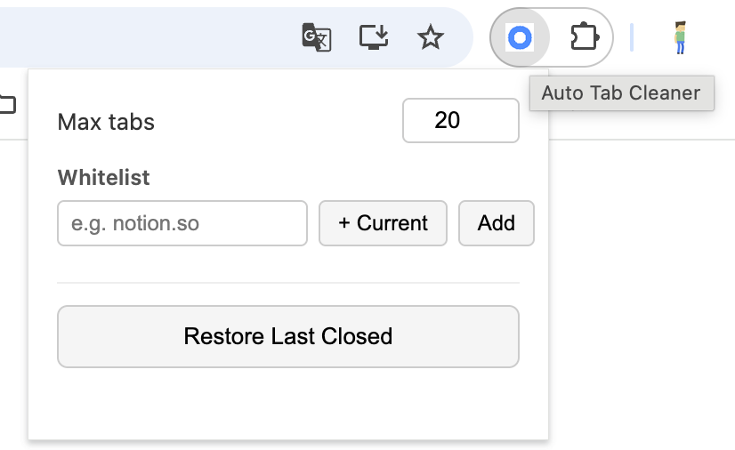
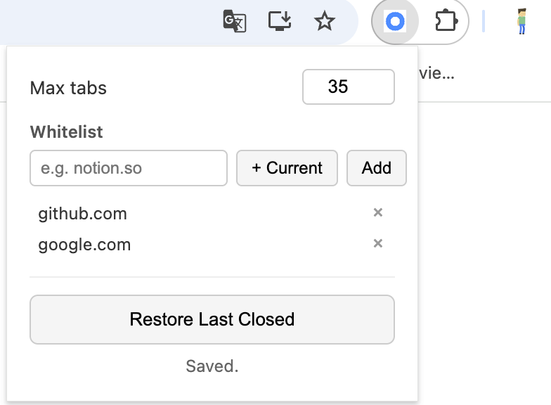

# Auto Tab Cleaner

[English](#english) | [中文](#中文)

---

## English

A minimal Chrome extension that automatically closes the least recently used tabs when you have too many open.

### How it works

When your open tab count exceeds the limit (default: 20), the extension automatically closes the oldest unused tabs until only the limit remains. It runs silently in the background — no setup required.

### Features

- Auto-closes least recently used tabs when the limit is exceeded
- Toggle auto-close on/off without losing your settings
- Toolbar badge always shows current tab count with color indicators:
  - Green — within the first third of the limit
  - Yellow — within the second third
  - Orange — approaching the limit
  - Red — over the limit
- Checks on every new tab and every 5 minutes
- Whitelist domains you never want auto-closed; add the current site with one click
- Restore the last batch of auto-closed tabs with one click
- Skips pinned tabs, the active tab, and tabs playing audio
- UI adapts to browser language (English & 简体中文)

### Installation

**From source:**

1. Download or clone this repository
2. Open Chrome and go to `chrome://extensions/`
3. Enable **Developer mode** (top right)
4. Click **Load unpacked** and select the `auto-tab-cleaner` folder

**From Chrome Web Store:**

Coming soon.

### Usage

The extension works automatically once installed. Click the toolbar icon to adjust settings:

| Setting | Description |
|---------|-------------|
| **Auto close** | Toggle automatic tab closing on or off |
| **Max tabs** | Maximum number of tabs to keep (default: 20) |
| **+ Current** | Add the current site to the whitelist |
| **Whitelist** | Domains that will never be auto-closed |
| **Restore Last Closed** | Reopen the last batch of auto-closed tabs |

**Default state** — just installed, no whitelist:

**With whitelist** — two domains added, Max tabs set to 35:

### Permissions

| Permission | Reason |
|------------|--------|
| `tabs` | Read tab info and close tabs |
| `alarms` | Periodic background checks |
| `storage` | Save your settings locally |

---

## 中文

一个极简的 Chrome 插件，当标签页数量超过上限时，自动关闭最久未使用的标签页。

### 工作原理

当打开的标签页数量超过设定上限（默认 20 个）时，插件自动关闭最久没有访问的标签页，直到剩余数量恢复到上限。全程静默运行，无需任何配置。

### 功能特性

- 超过上限时自动关闭最久未使用的标签页
- 可随时开关自动关闭功能，设置不会丢失
- 工具栏图标始终显示当前标签页数量，并根据数量显示不同颜色：
  - 绿色 — 在上限的前三分之一以内
  - 黄色 — 在上限的前三分之二以内
  - 橙色 — 接近上限
  - 红色 — 超过上限
- 每次新建标签页及每隔 5 分钟触发一次检查
- 支持白名单，一键将当前网站加入白名单，白名单内域名永不被关闭
- 一键恢复上一批被自动关闭的标签页
- 自动跳过：固定标签页、当前激活标签页、正在播放音频的标签页
- 界面根据浏览器语言自动切换（English & 简体中文）

### 安装方式

**从源码安装：**

1. 下载或克隆本仓库
2. 打开 Chrome，访问 `chrome://extensions/`
3. 右上角开启**开发者模式**
4. 点击**加载已解压的扩展程序**，选择 `auto-tab-cleaner` 文件夹

**从 Chrome 应用商店安装：**

即将上线。

### 使用说明

安装后插件自动运行，无需配置。点击工具栏图标可调整设置：

| 设置项 | 说明 |
|--------|------|
| **自动关闭** | 开启或关闭自动关闭功能 |
| **最多标签数** | 最多保留的标签页数量（默认 20） |
| **+ 当前网站** | 将当前网站加入白名单 |
| **白名单** | 白名单内的域名不会被自动关闭 |
| **恢复上次关闭的标签页** | 重新打开上一批被自动关闭的标签页 |

**初始状态** — 刚安装，白名单为空：

**添加白名单后** — 已添加两个域名，Max tabs 设为 35：

### 权限说明

| 权限 | 用途 |
|------|------|
| `tabs` | 读取标签页信息并执行关闭操作 |
| `alarms` | 定时在后台执行检查 |
| `storage` | 在本地保存用户设置 |
